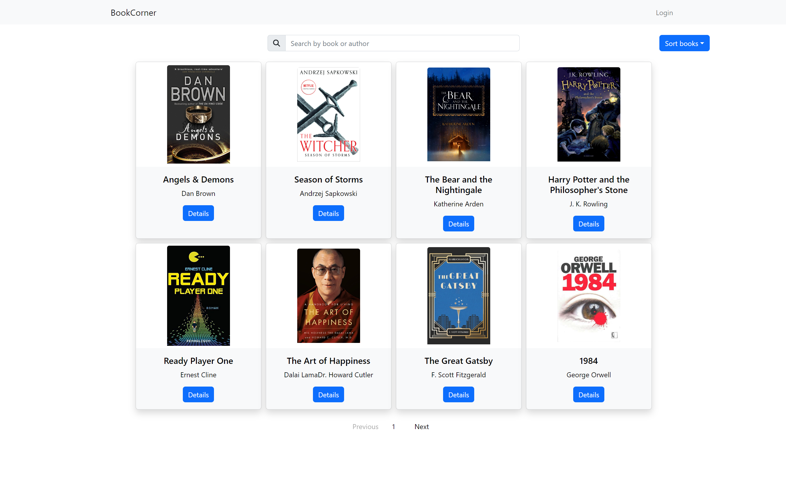
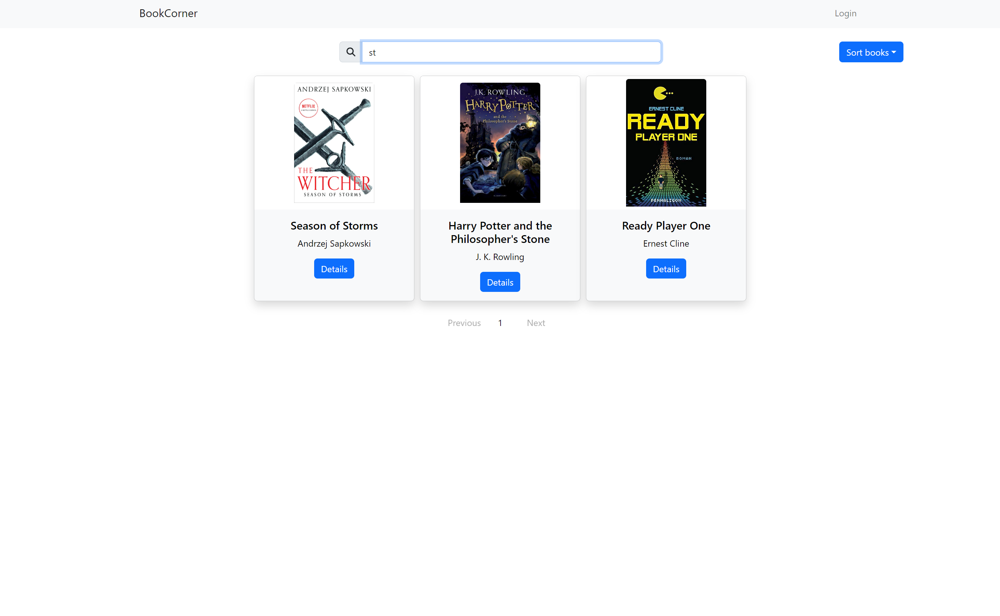
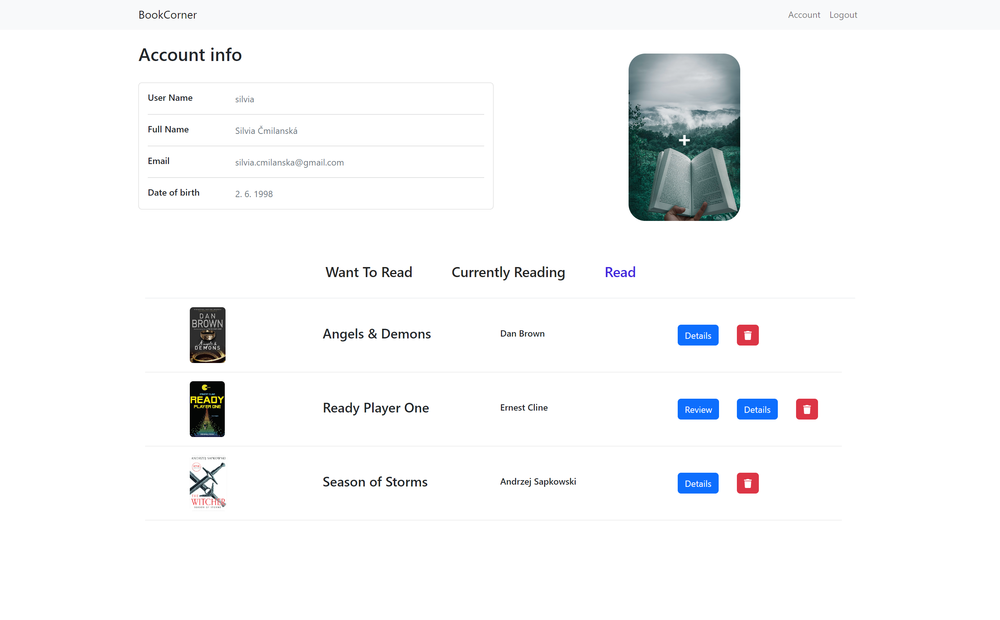
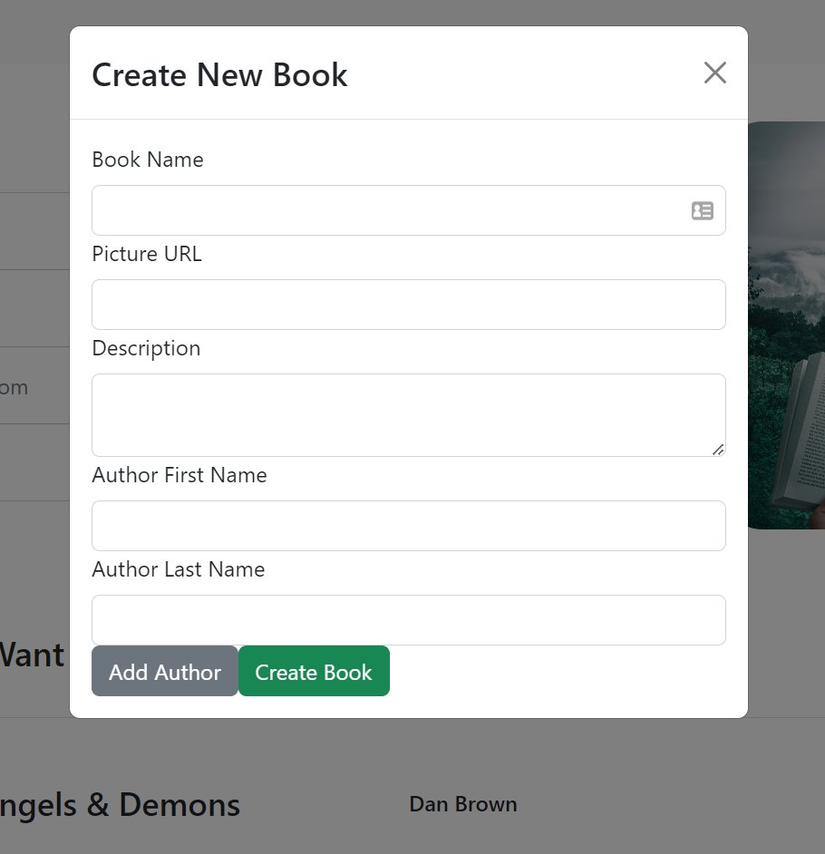
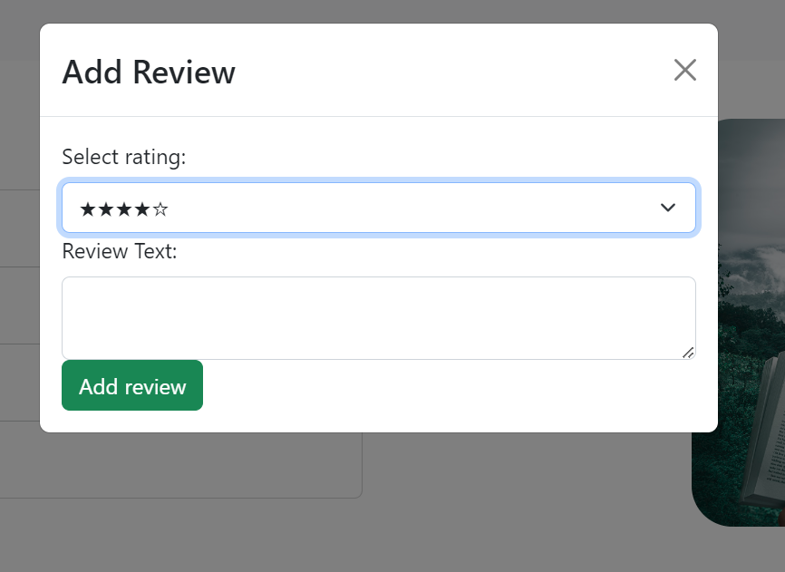
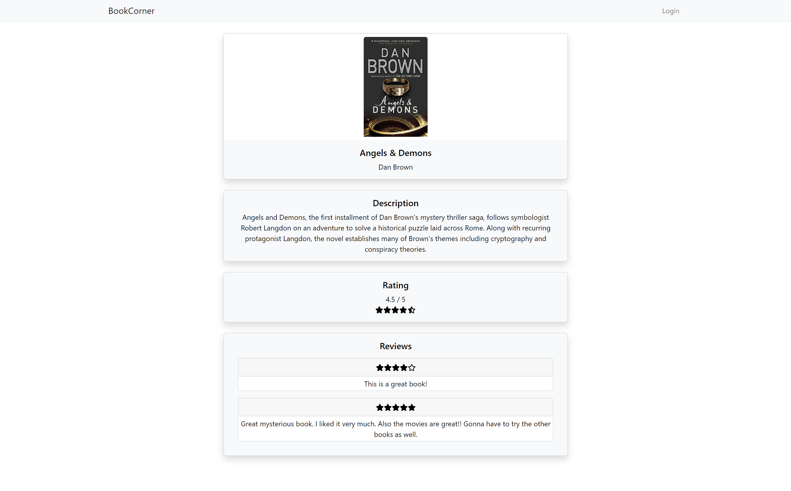
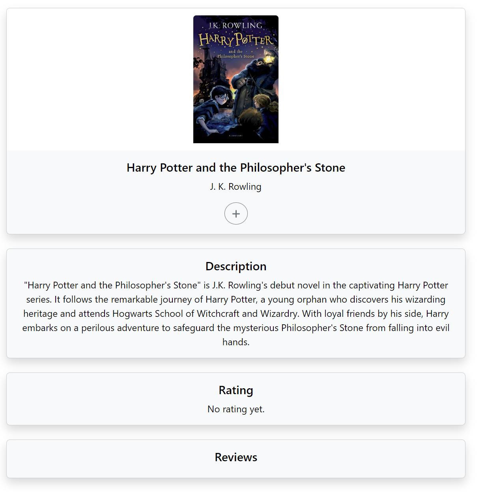
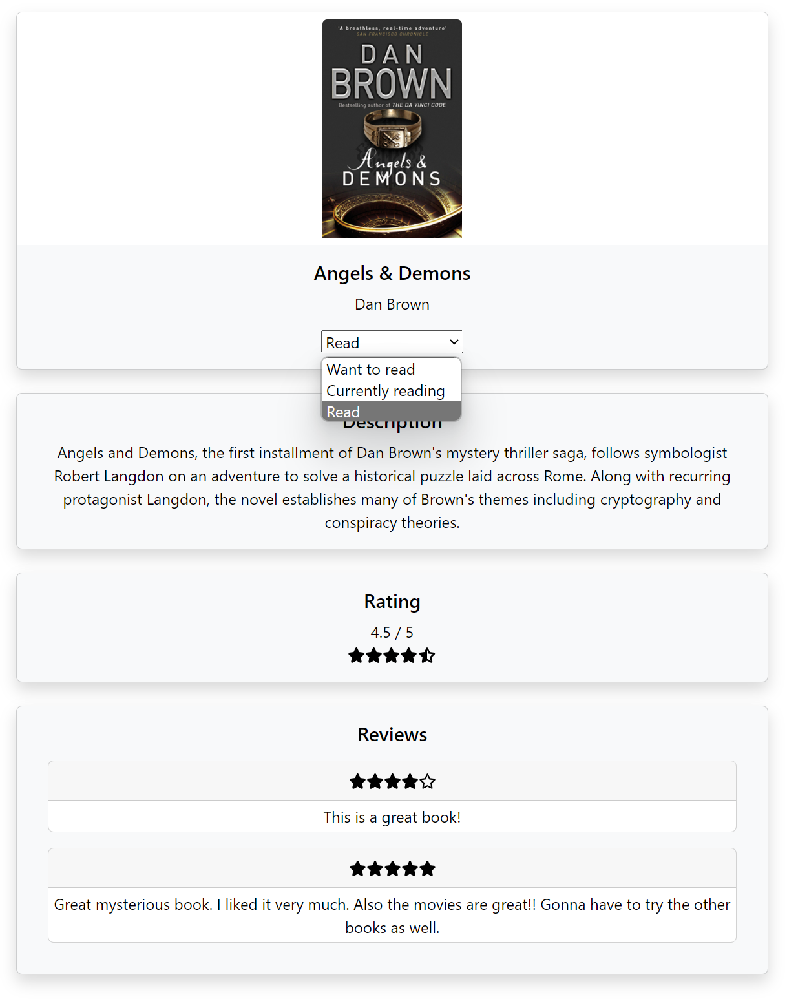

# BookCorner FE Application
This repository contains a web frontend application named BookCorner that allows users to track the books they read, to share book and review them.

## UI description

### Home page

Home page lists all books that are registered in BookCorner application. They are rendered as individual cards showing image, book title and author names. From home page you can be redirected to book details page by clicking on **Details** button located on book card or to login page by clicking on **Login** button in navigation. Book list can be sorted alphabetically by book name using dropdown on the upper right of the page.

Book list can be also filtered using search bar by book name and author name.

### Login

### User Account

User account page shows user information table. Button for adding new books and authors and three categories of user books: want to read, currently reading and already read.

The add book button shows modal window with form to add new book and its authors.

In list of users books the are buttons to remove book from list, to add review if the book is in category already read and to show book details.

  
  

### Book Details

Book details page shows image, title, authors, description, rating and reviews of selected book.

If user is logged in, he can add the book into one of his lists by category by clicking on the plus sing and selecting from dropdown in the modal window or if he already have the book in list, he can change the category from select component.

  
  

